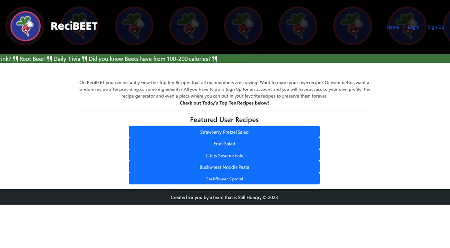

# ReciBEET

Created and coded by "Still Hungry Team"

## Description

ReciBEET hopes to provide dual functionality for its logged in users: provide known recipes and auto generate random recipes based on inputted ingredients. The web application will allow for users to save both types of recipes onto their profiles.
Additionally, ReciBEET will present a homepage for both logged in users and guests where they can find the top 10 recipes of the day which will be sorted based on most likes or most views.

## Instructions

When the page loads, you will be greeted by a homepage for both logged in users and guests where they can find the top 10 recipes of the day which will be sorted based on most likes or most views. Once logged in, you can auto generate random recipes based on inputted ingredients. You can save favorite recipes to your profile to access easier later on. You also have the option of creating your own recipes and saving them to your profile for quick and easy access.

## Screenshot

## Link to Deployed Application

https://recibeet-2d9ca1e028d6.herokuapp.com/

## Link to Github

https://github.com/torresorona/ReciBEET.git

## Purpose/Usage

Using the Spoonacular API we can display recipes based on ingredient input to our user.We can also save self created recipes to our profile for quick reference.

## License

Please refer to the LICENSE in the repo.

---